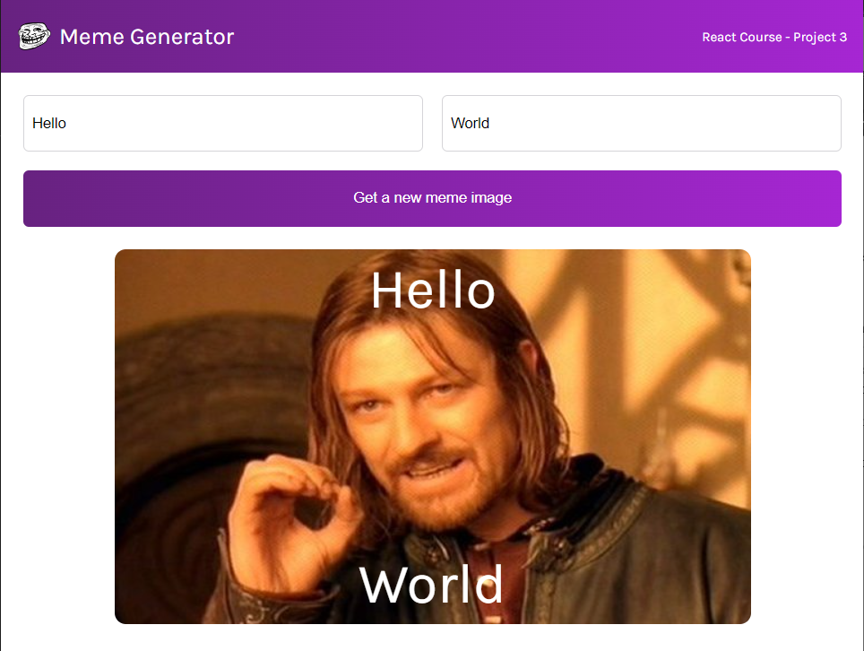

# Meme Generator 

This is a simple project built in React.

It has two textboxes that will add the entered text to the top and bottom of the image. 

The images is random and is pulled from the imgflip API. Everytime the button is pressed, a random image is grabbed. 
